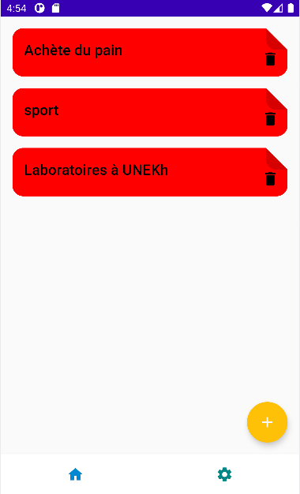
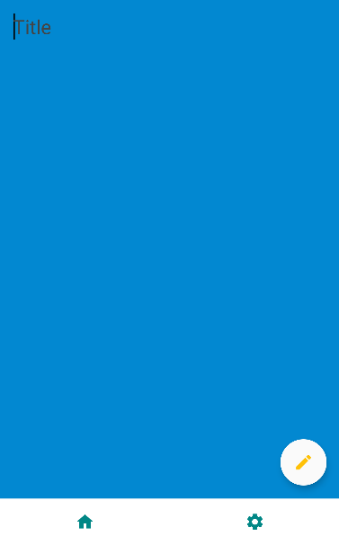

# Performer demo app

## This is simple app for manage your goals and tasks

---
### about *author*

**3 ans d'expérience** avec Android Framework, Java et Kotlin, création des applications de qualité en utilisant **Clean Architecture**, des principes **SOLID**.
Utilisation des approches de développement recommandées et de ces bibliothèques:

* AAC
* Navigation
   2.1 Cicerone
   2.2 NavComponent
* DI
   * Dagger2
   * Hilt
   * Koin
* Network
   * OkHttp
   * Retrofit
   * Gson
   * Moshi
* RxJava2
* Database
   * Room
   * SQLite
   * SQLDelight
* Kotlin Coroutines
* LiveData
* Glide
* Gragle
* Material Design
* Firebase
    * Analytics
    * Crashlytics
    * Database
    * Firestore
    * MLKit
    * Storege
* Google Maps

---
